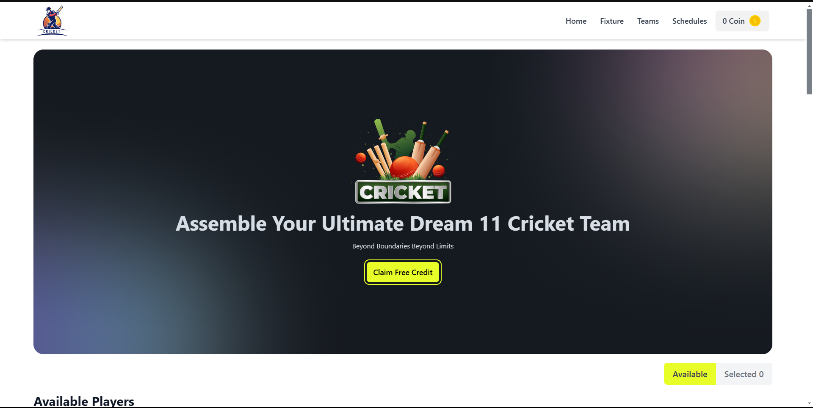
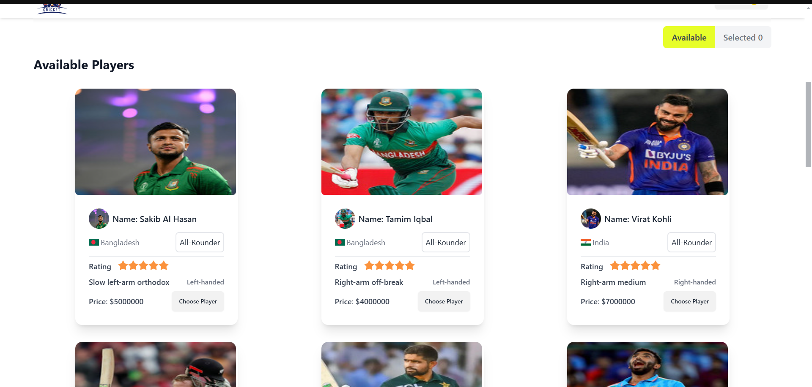
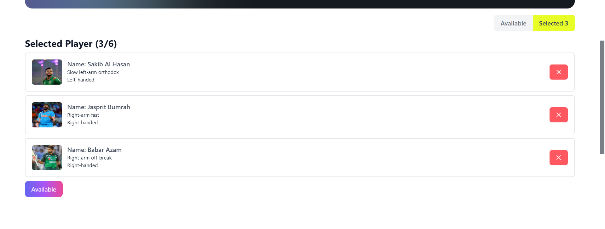
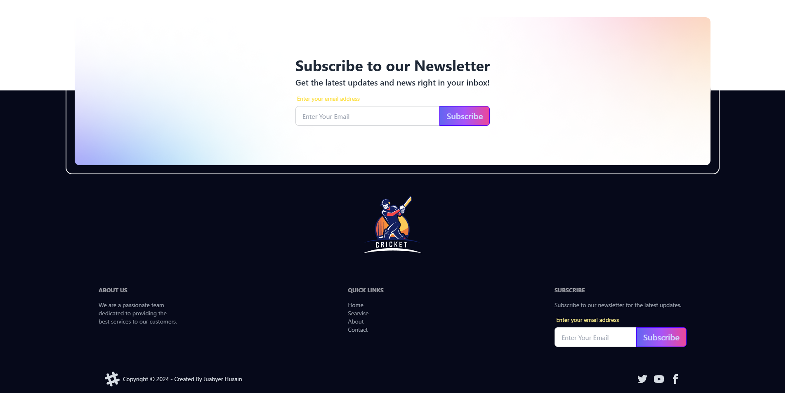

# Project Name: [BPL DREAM PLAYER TEAM]

## 🎉 Project Overview
This project is an interactive platform where users can explore information about various cricket players and purchase them to build their team. Each player has a designated credit value, allowing users to make strategic choices based on their balance. To maintain balance and ensure smooth gameplay, users can select up to six players, with notifications provided for limit excesses and insufficient balance. This feature-rich project brings an engaging team-building experience for cricket enthusiasts.

## 🛠️ Technologies Used
- **Frontend:** [React.js / HTML / CSS / JavaScript, etc.]
- **Libraries/Tools:** [React-Toastify/tailwind/ daisyUI ]

## 🌟 Key Features
- 1. **Player Credit System**
Users can buy players based on each player's assigned credit value, introducing a strategic element to the selection process.

- 2. **Player Purchase Limit**
Users can select up to six players. If they try to exceed this limit, a notification alert is shown, maintaining a balanced team-building experience.

- 3. **Balance Tracking**
The available balance is displayed and dynamically updated with each purchase. Users are restricted from buying players who exceed their current balance, with an alert provided if funds are insufficient.

- 4. **Interactive Player Selection**
Players are marked as "Available" or "Selected," enabling users to quickly identify which players are still selectable and which have been chosen for their team.

- 5. **Notification System**
With React-Toastify, users are notified on successful player purchases, duplicate selections, or if they exceed the player limit. These notifications enhance the user experience and keep users informed of their actions.

- 6. **User-Friendly Interface**
An attractive and intuitive UI design makes it easy for users to navigate through available players, track their balance, and manage their selected team seamlessly.

---

## 📸 Screenshots




---

## 🚀 Getting Started
1. **Clone the repository:** 
   ```bash
   repository link: https://github.com/programming-hero-web-course1/b10a7-dream-11-Jubayerhusain

live link: https://rj-assignment07.surge.sh/